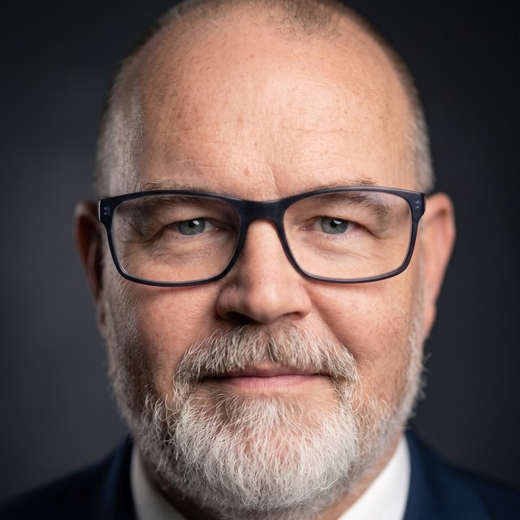
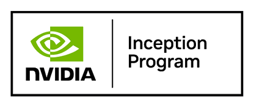

# About

> ZQUAS is built by Danny de Gier — 18 years in financial crime compliance at Tier-1 banks, now building GPU-native sovereign compliance infrastructure.

Source: https://zquas.ai/about.html
Site: https://zquas.ai

---
About

# Built by compliance. Not about compliance.

        ZQUAS exists because I spent 18 years inside the compliance function at Tier-1 banks, watching the same architectural failures repeat across every institution I worked at. The tools weren't broken. The architecture was wrong. So I built a different one.

    Danny de Gier
    Founder & Engineer

        Background

## Two careers in one

### The Compliance Career

I started in financial crime compliance in 2006 and spent the next 18 years inside the machine. RBS, Deutsche Bank, HSBC, Commerzbank on the banking side. ClearBank, Vivid Money, CoinMetro on the fintech side.

I've built onboarding frameworks, designed transaction monitoring rule sets, sat through regulatory examinations, written SARs, reviewed thousands of alerts, and watched analysts burn out on false positives that could have been avoided with better architecture.

I've seen what a €775 million fine does to a bank from the inside. I've seen what happens when a regulator loses confidence in your monitoring programme. And I've seen how compliance teams compensate for bad tooling with sheer headcount, hiring hundreds of analysts to manually review alerts that a better system would never have generated.

The Professional Postgraduate Diploma in Financial Crime Compliance from the International Compliance Association and University of Manchester formalised what I'd learned on the job. But the real education was sitting in the chair, across the table from examiners, defending systems I knew were inadequate.

### The Engineering Path

Somewhere along the way I started asking why compliance systems were so far behind the technology curve. Trading systems process millions of events per second. Game engines render entire worlds in real time. GPU computing had transformed AI, scientific simulation, and high-frequency finance.

Compliance was still running batch jobs overnight on CPU-based rule engines designed in the 2000s.

I taught myself GPU programming. C++, CUDA, Vulkan. Not as a hobby, but because I could see that the compliance problems I'd spent years working around were fundamentally compute problems that GPU architecture could solve. Entity resolution across millions of accounts. Policy evaluation against every transaction in real time. Cryptographic proof generation for regulatory verification. These are massively parallel workloads. They belong on GPU.

ZQUAS is the engine I wished I'd had during every compliance role I ever held. It's built by someone who has reviewed the SARs, built the rule sets, sat through the examinations, and also writes the GPU kernels. That combination shapes every architectural decision in the system.

        Experience

## Where I've worked

            2024 – Present

#### ZQUAS

                Founder & Engineer
                GPU-native compliance engine. C++/CUDA/Vulkan. Accepted into the FCA Digital Sandbox (March 2026). DNB InnovationHub submission under review. NVIDIA Inception programme member.

            Jul 2022 – Feb 2024

#### ClearBank

                Global Cryptoassets / Risk Director
                Defined digital asset risk appetite with the Executive Board. Enterprise-wide AML transformation. Acting MLRO.

            Mar 2020 – Feb 2022

#### Vivid Money

                Group Chief Risk & Compliance Officer, MLRO
                Board Member and Statutory Director. Built compliance from the ground up during 0 to 300 FTE scaling. Group DPO.

            Apr 2019 – Mar 2020

#### DLL / Rabobank

                Global AML Programme Lead
                Led global AML transaction monitoring program across 35 jurisdictions.

            Feb 2019 – Nov 2019

#### Crypterium

                Chief Compliance Advisor
                First- and second-line policies and controls for cryptocurrency fintech startup.

            Jun 2018 – Dec 2018

#### CoinMetro

                Head of Compliance, CCO & MLRO
                Full accountability for Legal, Risk, and Compliance. Recruited core compliance team for high-growth crypto ecosystem.

            Dec 2017 – Jun 2018

#### Commerzbank

                Senior Strategic Advisor: Trade Finance Financial Crime
                Enhanced financial crime controls in response to FCA s166 Skilled Person findings. Strategic roadmap for global Trade Finance.

            Sep 2016 – Jul 2017

#### Deutsche Bank

                Global Strategic Lead: Anti-Financial Crime Strategy & Sanctions
                40+ project compliance improvement program. Regulatory liaison with FED, FCA, and Independent Monitor.

            Dec 2014 – Jun 2016

#### Royal Bank of Scotland

                Global Head of Sanctions, Transaction Monitoring & Payments Filtering
                Primary technical and operational authority for Financial Crime within CIB. Team of 32 FTE.

            Jun 2014 – Dec 2014

#### HSBC

                Senior Strategic Project Manager: Global Sanctions & Trade Finance
                Translated global Sanctions policies into technical requirements within Financial Crime Compliance Change.

            Jun 2008 – Feb 2014

#### Royal Bank of Scotland

                Strategic Lead: AML Systems Integration & Operational Architecture
                Led ABN AMRO and RBS KYC/AML infrastructure integration. End-to-end client onboarding re-engineering.

            Pre-2008

#### ABN AMRO / LeasePlan / IBM

                AML Change Management, Systems Architecture & Enterprise Delivery
                Technical foundation in systems architecture, software development, and enterprise delivery.

        Qualifications

## Education & expertise

- **Professional Postgraduate Diploma in Financial Crime Compliance** — International Compliance Association / University of Manchester

- **Business Analysis Diploma** | **PRINCE2 Practitioner** — Project Management

- **GPU Systems Programming** — C++23, CUDA (sm_86/89/100/120), Vulkan

- **Domain expertise spanning 8 compliance domains** — AML, sanctions screening, fraud detection, KYC/KYB, trade surveillance, correspondent banking, crypto compliance, regulatory reporting

        Why This Matters

## The intersection that doesn't exist elsewhere

There are plenty of compliance professionals in the world. There are plenty of GPU engineers. The intersection of those two groups is essentially empty.

Most compliance technology is built by engineers who learn about compliance from documentation and customer interviews. They build what they think compliance teams need based on requirements documents and feedback sessions. The result is software that looks right on a demo but misses the operational realities that only become visible after years inside the function.

ZQUAS is different because every design decision comes from direct experience. The policy language exists because I've written rules in vendor tools that couldn't express what the regulation actually required. The cryptographic attestation exists because I've spent weeks reconstructing audit trails during regulatory examinations and wished I could just hand the examiner a proof. The GPU architecture exists because I've watched banks hire 500 additional analysts to compensate for a monitoring system that couldn't keep up with transaction volume.

The engine doesn't just solve compliance problems technically. It solves them in the way that compliance professionals actually need them solved.

        Team

## The people behind ZQUAS

                 

                    Danny de Gier
                    Founder & Engineer

18 years in financial crime compliance at Tier-1 banks. RBS, Deutsche Bank, HSBC, Commerzbank on the banking side. ClearBank, Vivid Money, CoinMetro on the fintech side.

Self-taught GPU engineer. Writes the C++, CUDA, and Vulkan that ZQUAS runs on. Every design decision in the engine comes from sitting across the table from examiners and defending monitoring systems he knew were inadequate.

**Professional Postgraduate Diploma in Financial Crime Compliance**, International Compliance Association / University of Manchester.

                 

                    Martin van Aalderen
                    Chief Commercial & Corporate Development Officer

Entrepreneur with 20+ years in global financial markets. Former founder and CEO of Object+, a financial software firm operating across Europe and the United States.

Spent his career at the intersection of banking, capital markets, and enterprise software. Leads commercial strategy, partnerships, and corporate development at ZQUAS, taking the engine to banks and financial institutions.

**Previous:** Object+ Financial Services BV, Object+Chicago LLC, ABN AMRO, ING.

        Advisory Board

## Guided by practitioners

### Frenkel Drevers — Regulatory Advisor

25+ years in financial services regulation. Former Manager at the Autoriteit Financiële Markten (AFM), the Dutch financial markets regulator, where he led supervisory audits, managed MiFID implementation, and provided regulatory interpretation guidance to financial institutions.

Subsequently spent 15 years advising banks, fintechs, and payment institutions on compliance, risk management, and regulatory licensing (DNB, AFM, FSMA) at Charco & Dique / Projective Group. Now independent, supporting international payment institutions and investment firms on compliance and governance.

Frenkel brings direct regulatory experience from both sides of the table: as regulator and as advisor to regulated firms.

        Programmes & Recognition

## Backed by the institutions that matter

                 

### NVIDIA Inception program member

ZQUAS is a member of the NVIDIA Inception program. Inception is NVIDIA's global program for technology startups, providing access to developer resources, technical training, and exposure to the venture community. The program supports ZQUAS's GPU-native compliance work on the CUDA platform.

### FCA Digital Sandbox

ZQUAS was accepted into the Financial Conduct Authority's Digital Sandbox in March 2026. The Digital Sandbox is the FCA's environment for testing innovations against synthetic regulatory data, with access to mentors and supervisory feedback.

### DNB InnovationHub

Submission under review with De Nederlandsche Bank's InnovationHub, the Dutch central bank's point of contact for firms developing financial innovations relevant to supervised activity.

        AI-Ready Distribution

## Connect ZQUAS to your AI assistant

### Model Context Protocol server

ZQUAS publishes a public MCP server at `https://mcp.zquas.ai/mcp`. Compliance officers, analysts, regulators, and engineers running Claude Desktop, Claude Code, Cursor, Zed, or any other MCP-compatible AI tool can add one line to their config and have ZQUAS available as a first-class knowledge source. The model can search every page, look up glossary terms, and retrieve published benchmark numbers as structured data. Public, no authentication. Built so an AI assistant grounds its answers in current ZQUAS material rather than stale training data.

Server card: [/.well-known/mcp/server-card.json](/.well-known/mcp/server-card.json). Setup instructions: [/llms.txt](/llms.txt).

        Contact

## Let's talk

            Interested in sovereign compliance infrastructure for your institution? Open to conversations with banks, regulators, and technology partners.

            [Get in touch](contact.html)
